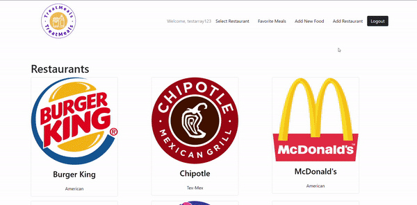
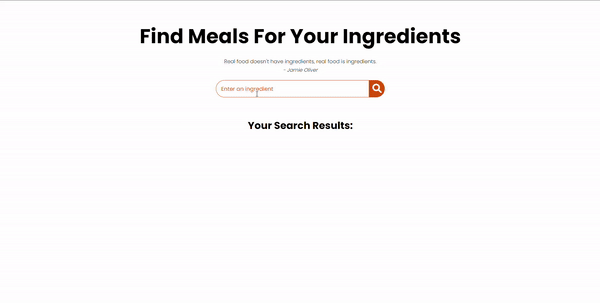
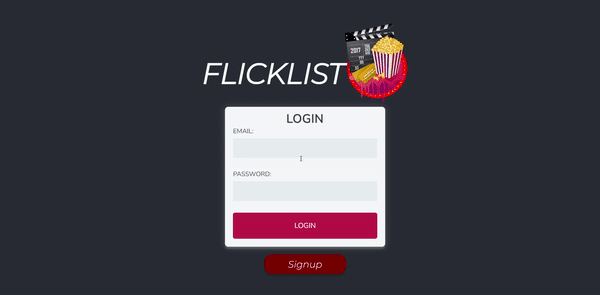

# TreatMeals  

### Eat your favorite foods from various fast food and restaurant locations while sticking to your macros!

 

## Tech Used: , EJS, Express

My learning was focused on understanding how to create a full stack, CRUD application with authentication.

## Optimizations

To improve this project, I would like to add a feature wherein users can not only bookmark their favorite meal items, but can also save favorite food combinations. Additionally, it would be nice to add a nutrition label with all nutrition details in the details page for each meal item - I might consider connecting to the Nutritionix API to retreieve some nutrition information.

## Lessons Learned:

First and foremost, I learned how to add authentication to a CRUD application. Additionally, I learned:

- How to use reusable partials to increase development efficiency
- How to use Chart.js to display data in interactive, aesthetic charts and graphs
- How to implement Boostrap and Daisy UI to create a visually appealing user interface

## More Projects

<table bordercolor="#66b2b2">
  
  <tr>
    <td width="33.3%"  style="align:center;" valign="top">
<a target="_blank" href="https://github.com/christurc29/Recipe-Generator">Recipe Generator</a>
         
      
    </td>
    <td width="33.3%" valign="top">
<a target="_blank" href="https://github.com/christurc29/Portfolio"> Portfolio</a>
       
        
    </td>
    <td width="33.3%" valign="top">
<a target="_blank" href="https://github.com/christurc29/FlickList">FlickList</a>
         
        
    </td>
  </tr>
</table>
